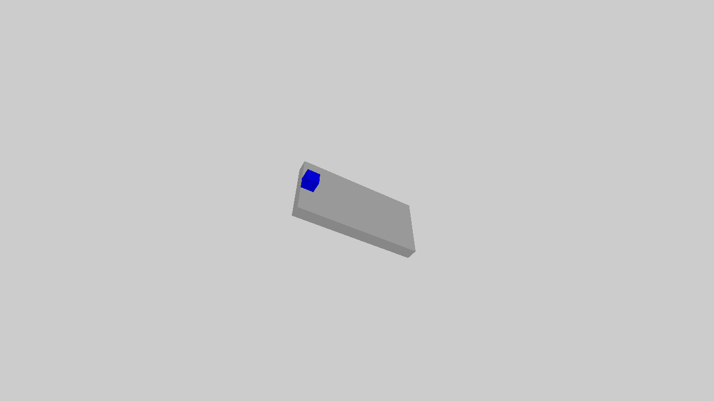

.. _physics:

Physics
==================

.. highlight:: python

Since SAPIEN is a physical simulation framework, we would like to showcase how to change physical properties which lead to different behaviors.

In this tutorial, you will learn the following:

* Use ``PhysxSceneConfig`` to initialize default physical properties
* Use ``PhysxMaterial`` to set different physical materials
* Create kinematic actors
* Enable damping for actors
* Get kinematic quantities (pose, velocity, angular velocity) of an rigid body

The example illustrates an object sliding down the slope.
You can run the script with different arguments.
``transforms3d`` is required to compute poses, which can be installed by ``pip install transforms3d``.

The full script can be downloaded here :download:`physics.py <scripts/physics.py>`

Set default physical properties
-------------------------------------

Default physical properties can be specified when a scene is created.
Those properties include gravity, static and dynamic friction, as well as `restitution <https://en.wikipedia.org/wiki/Coefficient_of_restitution>`_ (elasticity of collision).

.. literalinclude:: scripts/physics.py
   :dedent: 0
   :lines: 101-120

Note ``PhysxSceneConfig`` describes physical properties global to a scene. However, the default physical material is global to the entire SAPIEN process.

Set physical materials
-------------------------------------

``PhysxMaterial`` describes physical (contact) properties (friction and restitution) of the material of an PhysX rigid body.
It can be specified in the ``ActorBuilder`` when an actor is created.
If not provided, the default physical material, induced by the scene's default physical properties, will be used.

.. literalinclude:: scripts/physics.py
   :dedent: 0
   :lines: 108-113

Some other physical properties, like density, are directly provided to collision shapes. We update ``create_sphere`` function in :ref:`create_actors`.

.. literalinclude:: scripts/physics.py
   :dedent: 0
   :lines: 59-74
   :emphasize-lines: 6,7,12

.. note::
   The rolling resistance (friction) is not modeled currently in SAPIEN.

Create a kinematic actor
-------------------------------------

Now, let's create a slope.
The slope should be a **kinematic** object, rather than a **dynamic** object.
In other words, it can not be affected by external forces.
We can set ``is_kinematic=True`` when building the actor.

.. literalinclude:: scripts/physics.py
   :dedent: 0
   :lines: 22-56
   :emphasize-lines: 6,30,31

Set damping for the actor
-------------------------------------

Sometimes, you might model some resistance proportional to (linear or angular) velocity, like air resistance.
It can be achieved by setting the **damping** of an actor.

.. literalinclude:: scripts/physics.py
   :dedent: 0
   :lines: 193-194

Get kinematic quantities (pose, velocity) of an actor
------------------------------------------------------------

We can acquire kinematic quantities (pose, linear velocity, angular velocity) of an actor through ``get_pose()``, ``get_linear_velocity()``, ``get_angular_velocity()``.

.. literalinclude:: scripts/physics.py
   :dedent: 0
   :lines: 218-220
