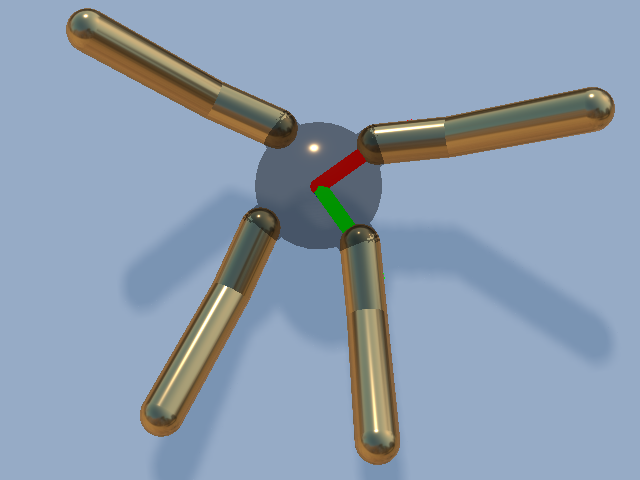
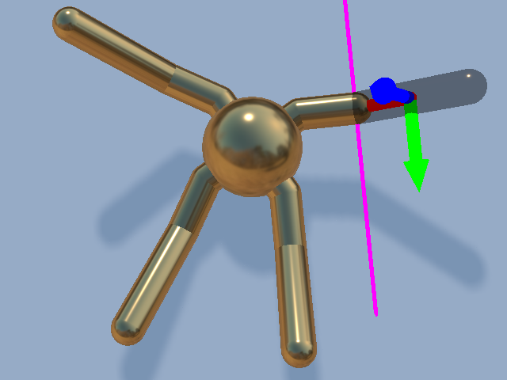
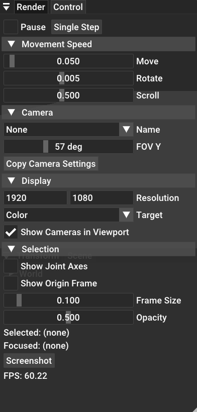
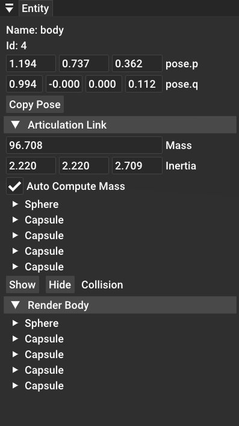
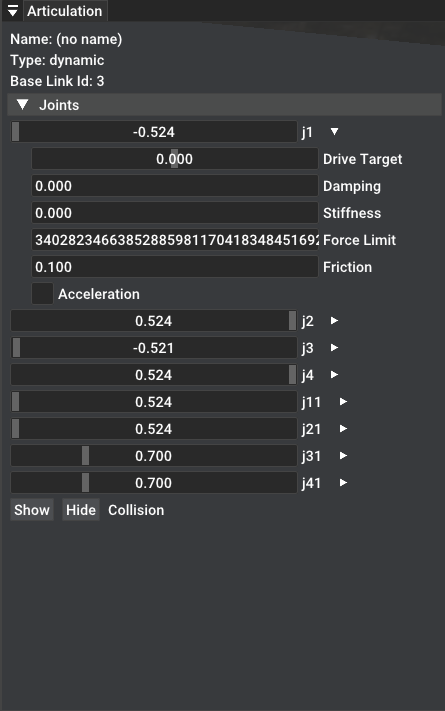
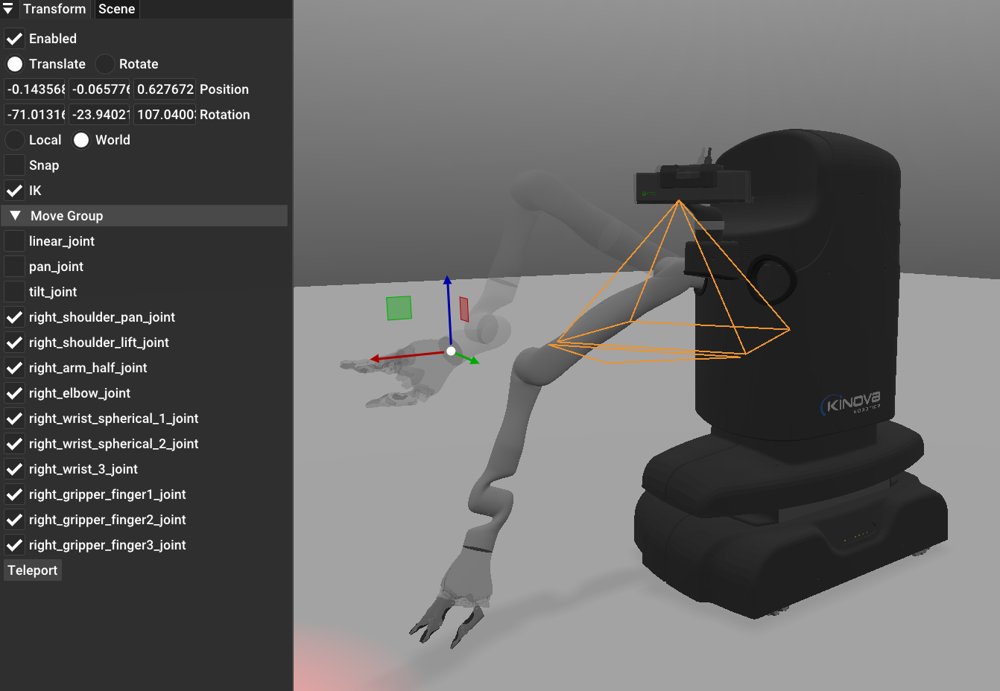

.. _viewer:

Viewer
==================

.. highlight:: python

If you have completed the :ref:`hello_world` section. You probably have used the
viewer already. In this section we explain how to use the GUI of the viewer.

Free Camera Control
-------------------------------------------

Use the following keys to move the free camera around:

| ``w`` move forward.
| ``s`` move backward.
| ``a`` move to the left.
| ``d`` move to the right.

Press the ``Right Mouse Button`` and drag in the scene to rotate the camera.

Press the ``Middle Mouse Button`` and drag in the scene to translate the camera.
This allows moving the camera up and down.

All the operations above will be slower if ``Shift`` key is pressed. The speed
can also be changed in the ``Control Window`` described below.

Actor Selection
-------------------------------------------

Aim the mouse cursor at an actor in the scene and press ``Left Mouse Button`` to
select it. The selected actor should become translucent and a set of coordinate
axes will be placed at the origin of this actor. If the selected actor is an
articulation link with a revolute parent joint, a magenta line will appear to
indicate the rotation axis. For prismatic parent joint, a cyan line will show
the translation axis.

Information of the selected actor will be displayed in the ``Entity Window``
described in detail below. The figure below shows selecting an actor without a
movable parent joint and an actor with a parent revolute joint.

Focused Camera Control
-------------------------------------------

Press ``f`` when an actor is selected will enter the ``Focused Camera Control``
mode. In this mode, the center of the camera will be "focused" on the selected
object. In this mode, the ``Right Mouse Button`` rotates around the object
instead of the camera center. Additionally the ``Mouse Wheel`` can be used to zoom
in and out. The ``Shift`` key can still be used to slow down the camera
movement. Pressing any of ``wasd`` will put you back into the ``Free Camera
Control``.

Control Window
-------------------------------------------

The control window (shown below) by default appears at the top-left of the GUI.

The ``Pause`` checkbox, when checked, will pause the simulation (entering an
infinite rendering loop). You can still move the viewer camera around and even
change the pose of objects (details in later sections). The ``Single Step``
button let you jump out of the rendering loop for once.

The ``Camera Speed`` section allows you to adjust the speed for various mouse
operations. ``Move`` slider adjusts movement speed of ``wasd``. ``Rotate``
adjust the rotating speed when pressing down ``Right Mouse Button``. ``Scroll``
adjusts the zoom speed in ``Focus Camera Control``.

The ``Name`` selection in ``Camera`` section allows viewing from mounted cameras
in the scene. It will follow the movement of the selected mounted camera. ``Fov
Y`` changes the FOV of the viewer camera.

The ``Display Settings`` section allows adjusting some display settings.
``Target`` changes the displayed picture (picture names are specified in the
GLSL shaders provided by SAPIEN). ``Resolution`` changes the window resolution
(note this may not always succeed as window managers can override this setting,
for example, it has no effect in full-screen mode).

The ``Selection`` section adjust entity selection behavior. ``Show Joint Axes``
allows showing the revoltue/prismatic axes of articulation joints. ``Show Origin
Frame`` checkbox can turn on/off the axes display. ``Frame Size`` adjusts the
size of the axes. ``Opacity`` adjusts the opacity of the selected actor.

Finally ``FPS`` displays the current rendering FPS. Note this value does not
represent the time to render a frame, as it is v-synced and affected by CPU
operations (simulation, Python code execution, etc.)

Scene Window
-------------------------------------------

The ``Scene Window`` by default is located at the bottom-left corner of the GUI.
It displays information about entities in the scene By expanding the scene, you
can inspect all entities currently placed in the scene. The currently selected
entity will be highlighted. ``Left Click`` on any actor will select it as if it
is clicked in the scene viewport. This allows you to select entities without a
visual body.

Entity Window
-------------------------------------------

The ``Entity Window`` by default is located at the top-right corner of the GUI.
It displays information about the selected entity.

``Entity Window`` first displays the entity ``name`` and ``per_scene_id``. Next
the global position and rotation (quaternion wxyz) are shown.

Next, each attached component will have its own section. For example, an
``PhysxArticulationLinkComponent`` shows its mass, inertia, collision shapes.
And allows showing/hiding collision shape with a click.

Each collision shape is expandable. Depending on the collision type, you can see
its type-specific information such as radius or scale. Some common attributes
are the following. ``Contact offset`` the maximum distance where the shape will
come into contact with other shapes. ``Rest offset`` the distance where the
shape will collide with other objects (usually 0). ``Patch radius`` and ``Min
patch radius`` are related to the torsional friction of contact points.
``Static friction`` and ``Dynamic friction`` are the friction coefficients.
``Restitution`` is the restitution coefficient of this shape. Next 4 collision
groups are shown in hexadecimal.

Articulation Window
-------------------------------------------

The ``Articulation Window`` by default is located at the bottom-right corner of
the GUI. It displays information about the parent articulation of selected actor.

First, the ``Name``, ``Type`` and ``Base Link Id`` of the articulation are
displayed. Next in the expandable section ``Joints``. The joint position and
joint name for each joint is displayed. On the right of the joint names, there
are some ``+`` buttons to allow further expanding each joint. When expanded, you
can change the ``Drive Target``, ``Damping``, ``Stiffness``, ``Force Limit``,
and ``Friction`` of this joint. Simply type in the desired number and press
``Enter``. The ``Acceleration`` checkbox indicates whether this joint is driven
by force or acceleration. When driven by acceleration, the drive force scales
automatically by the mass and inertia of the driven object. Finally, the
``Show``, ``Hide`` collision buttons are a convenient way to see the collision
shapes for the entire articulation.

Transform Window
-------------------------------------------

The ``Transform Window`` allows you to move objects in the scene directly. When
enabled, A gizmo will be placed at the origin of the selected entity. Dragging
the handles will display a translucent image of the object being moved, and
clicking on teleport will set the pose of the selected entity to the new pose.
The gizmo control can be fine-tuned in the ``Transform Window`` to allow
translating and rotating in local or world frame.

If the selected entity has a ``PhysxArticulationLinkComponent``, the Gizmo
additionally spuports moving with inverse kinematics (IK). The joints that are
allowed to particilate in IK computation can be changed in the ``Move Group``.
Now dragging the Gizmo will invoke an IK solver to compute proper articulation
joint angles.
