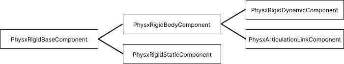

.. _physx:

PhysX Components
==================================

This section discusses how to build and access rigid and articulated objects
simulated with the PhysX simulator. To make the building process of a rigid or
articulated object simpler, SAPIEN provides builder classes `actor_builder`
and `articulation_builder` wrapped around the low-level component API.

Rigid Body Hierarchy
----------------------------------

There are 3 types of rigid components in SAPIEN ``PhysxRigidStaticComponent``,
``PhysxRigidDynamicComponent``, and ``PhysxArticulationLinkComponent``.

All 3 types components shared the same base class ``PhysxRigidBaseComponent``
which implements the ``attach`` function that allows attaching collision shapes
of type ``PhysxCollisionShape``.

``PhysxRigidDynamicComponent`` and ``PhysxArticulationLinkComponent`` are both
affected by forces, and they share the ``PhysxRigidBodyComponent`` base class,
which provides functions related to mass properties, external forces, velocity,
damping, etc.

The class hierarchy is summarized in the figure below.

Rigid Static Component
----------------------------------

``PhysxRigidStaticComponent`` describes a static object that never moves.
Setting pose of a static component is expensive and should be avoided.

Rigid body Component
----------------------------------
``PhysxRigidBodyComponent`` is used for bodies that are affected by forces,
including rigid dynamic bodies and articulation links.

Mass properties
^^^^^^^^^^^^^^^^^^^^^^^^^^

A rigid body has mass properties, including mass, center of mass, and moment of
inertia.

+----------------+------+----------------------------+
|Property        |Type  |Description                 |
+================+======+============================+
|mass            |float |Mass of the rigid body      |
|                |      |                            |
+----------------+------+----------------------------+
|inertia         |float3|Principal inertial          |
|                |      |                            |
+----------------+------+----------------------------+
|cmass_local_pose|Pose  |Position: center of mass;   |
|                |      |Rotation: frame for moment  |
|                |      |of inertia                  |
+----------------+------+----------------------------+

Dynamics
^^^^^^^^^^^^^^^^^^^^^^^^^^

A rigid body supports the following dynamic properties

+--------------------------+------+--------------------------------+
|Property                  |Type  |Description                     |
+==========================+======+================================+
|disable_gravity           |bool  |The body is not affected by     |
|                          |      |gravity if set to true          |
+--------------------------+------+--------------------------------+
|linear_damping            |float |Damping on linear motion        |
+--------------------------+------+--------------------------------+
|angular_damping           |float |Damping on angular motion       |
+--------------------------+------+--------------------------------+
|max_depenetration_velocity|float |Controls how much velocity the  |
|                          |      |solver can introduce to correct |
|                          |      |for penetrations in contacts    |
+--------------------------+------+--------------------------------+
|max_contact_impulse       |float |Limit of impulse that may be    |
|                          |      |applied by a contact            |
+--------------------------+------+--------------------------------+
|linear_velocity (readonly)|float3|Linear velocity of center of    |
|                          |      |mass                            |
+--------------------------+------+--------------------------------+
|angular_velocity          |float3|Angular velocity of center of   |
|(readonly)                |      |mass, under world frame         |
|                          |      |orientation                     |
+--------------------------+------+--------------------------------+

Rigid Dynamic Component
----------------------------------

A rigid dynamic component is a rigid body that can move freely. A special type
of rigid dynamic component is kinematic object, enabled with the property
``kinematic``. A kinematic body is not affected by external forces. It may be
moved by setting the ``kinematic_target`` property. An kinematic object moved
this way will interact with other bodies along the way. In contrast, a kinematic
body moved with ``set_pose`` will be teleported and not interact with other
bodies.

+--------------------------+--------+--------------------------------+
|Property                  |Type    |Description                     |
+==========================+========+================================+
|kinematic                 |bool    |Kinematic body is not affected  |
|                          |        |by external force               |
+--------------------------+--------+--------------------------------+
|kinematic_target          |Pose    |Next step global pose of a      |
|                          |        |kinematic body                  |
+--------------------------+--------+--------------------------------+

Articulation Link Component
----------------------------------

An articulation link component represents one segment of an articulation. The
pose and velocity of an articulation link is controlled by the kinematic chain
thus are read-only properties. Each articulation link has an associated
joint of type ``PhysxArticulationJoint``.

Articulation Joint
^^^^^^^^^^^^^^^^^^^^^^^^^^^^^^^^^^

Articulation joint uses the follow properties.

The type of a joint can be one of "fixed", "revolute", "revolute_unwrapped",
"prismatic", "free". The "free" joint only indicates a free root link.
"revolute_unwrapped" indicates a revolute joint whose limit can extend beyond
:math:`\pm2\pi`.

+--------------------------+----------+--------------------------------+
|Property                  |Type      |Description                     |
+==========================+==========+================================+
|type                      |str       |One of "fixed", "revolute",     |
|                          |          |"revolute_unwrapped",           |
|                          |          |"prismatic", "free"             |
+--------------------------+----------+--------------------------------+
|dof (readonly)            |int       |Degree of freedom of this joint |
+--------------------------+----------+--------------------------------+
|friction                  |float     |Joint friction                  |
|                          |          |                                |
+--------------------------+----------+--------------------------------+
|armature                  |float     |Joint armature                  |
|                          |          |                                |
+--------------------------+----------+--------------------------------+
|limit                     |float[dof,|Upper and lower limits for each |
|                          |2]        |dof of the joint                |
+--------------------------+----------+--------------------------------+
|pose_in_child             |Pose      |Anchor pose relative to the     |
|                          |          |child link                      |
+--------------------------+----------+--------------------------------+
|pose_in_parent            |Pose      |Anchor pose relative to the     |
|                          |          |parent link                     |
+--------------------------+----------+--------------------------------+

A built-in PD controller is supported by revolute and prismatic joints. You can
use ``set_drive_properties`` to specify the parameters for this controller. The
following properties are associated with the PD controller.

+--------------------------+----------+--------------------------------+
|Property                  |Type      |Description                     |
+==========================+==========+================================+
|stiffness                 |float     |Stiffness (Kp) for the PD drive |
|                          |          |                                |
|                          |          |                                |
+--------------------------+----------+--------------------------------+
|damping                   |float     |Damping (Kd) for the PD drive   |
+--------------------------+----------+--------------------------------+
|force_limit               |float     |Maximum force that can be       |
|                          |          |applied by the PD drive         |
+--------------------------+----------+--------------------------------+
|drive_mode                |str       |One of "force", "acceleration". |
|                          |          |In acceleration mode, the PD    |
|                          |          |drive becomes invariant to link |
|                          |          |masses by controlling           |
|                          |          |acceleration directly           |
+--------------------------+----------+--------------------------------+

Collision Shape
----------------------------------

Collision shapes can be attached to any ``PhysxRigidBaseComponent``. There are 7
types of collision shapes.

- ``PhysxCollisionShapePlane`` is an infinite plane, which is typically used as
  the ground. This shape can only be used with static or kinematic objects.
- ``PhysxCollisionShapeBox`` represents a box, characterized by ``half_size``.
- ``PhysxCollisionShapeSphere`` represents a sphere characterized by ``radius``.
- ``PhysxCollisionShapeCapsule`` represents a capsule characterized by
  ``radius`` and ``half_length``.
- ``PhysxCollisionShapeCylinder`` represents a cylinder characterized by
  ``radius`` and ``half_length``
- ``PhysxCollisionShapeConvexMesh`` represents a convex mesh.
- ``PhysxCollisionShapeTriangleMesh`` represents any triangle mesh. However, it
  may only be used for static or kinematic objects.

Joint Component
----------------------------------

Drive Component
----------------------------------

Gear Component
----------------------------------
