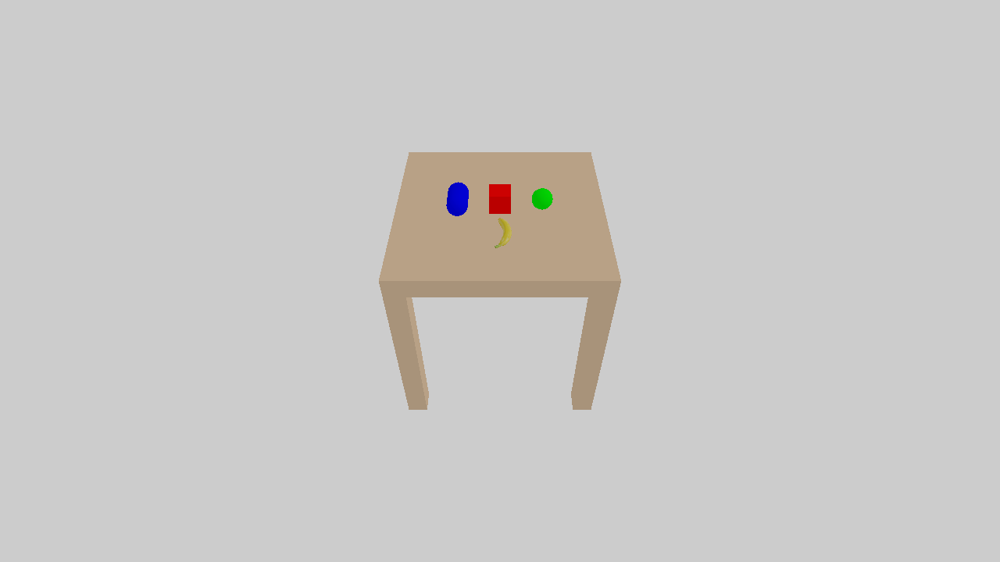

.. _create_actors:

Create Actors
==================

.. highlight:: python

Every object added to a SAPIEN ``Scene`` is an ``Entity``. An ``Entity`` with
physical properties is commonly called an **actor**.

In this tutorial, you will learn the following:

* Create ``Entity`` and add ``Component``
* Create rigid body actors using primitives (box, sphere, capsule)
* Create rigid body actors using mesh files
* Use ``Pose`` to set the pose of an Entity

The full script can be downloaded here :download:`create_actors.py <scripts/create_actors.py>`.
The collision and visual meshes of the banana are avilable at
:download:`collision.obj <assets/banana/collision_meshes/collision.obj>` and :download:`visual.glb <assets/banana/visual_meshes/visual.glb>`

Create an Entity
----------------------

The only properties of an ``Entity`` include a pose (position and rotation) and
a name. The behavior of an ``Entity`` is completely determined by its attached
components. A ``PhysxRigidDynamicComponent`` makes the entity follow rigid body
dynamics in the PhysX simulator. A ``RenderBodyComponent`` allows this entity to
be rendered by cameras.

The following code shows how we create an Entity, set its pose and name, attach
a physical component and a render component, and add it to the scene.

.. literalinclude:: scripts/create_actors.py
   :dedent: 0
   :lines: 20-71

.. note::
   Collision shapes do not necessarily correspond to visual shapes.
   For example, you might have a simple collision shape for fast simulation, but a complicated visual shape for realistic rendering.

The pose of the box in the world frame can be specified by ``Pose``. ``Pose``
describes a 6D pose, consisting of a 3-dim position vector ``p`` and a 4-dim
quaternion ``q`` (to represent the rotation, in the wxyz convention).

Create an actor with ActorBuilder
-------------------------------------------

Creating an actor with the low-level entity API seems a bit tedious, so we
provide a convenience class ``ActorBuilder`` intended for building actors. The
same box can be create with the following code.

.. literalinclude:: scripts/create_actors.py
   :dedent: 0
   :lines: 74-99

Apart from box, the primitive shapes supported by SAPIEN also include sphere,
capsule and cylinder. Example code for creating sphere and capsule are included
in the code. A cylinder is a special primitive, since a cylinder collision
primitive is not natively supported by PhysX. We implement cylinder collision
with a convex mesh.

Create an actor with multiple primitives
-------------------------------------------

Next, we show an example to create an actor (table) by multiple boxes (a tabletop with four legs).

.. literalinclude:: scripts/create_actors.py
   :dedent: 0
   :lines: 135-173

We can call ``add_box_collision(pose=Pose(...), ...)`` to set the pose of a collision shape in **the actor frame**.
Similarly, we can call ``add_box_visual(pose=Pose(...), ...)`` for a visual shape.
Note that ``table.set_pose(pose)`` sets the pose of the actor in **the world frame**.

Create an actor from a mesh file
-------------------------------------------

Apart from primitives, actors can also be created from mesh files.

.. literalinclude:: scripts/create_actors.py
   :dedent: 0
   :lines: 218-224

.. note::
   Any collision shape for dynamic rigid bodies in SAPIEN is required to be convex.
   To this end, a mesh will be "cooked" into a convex mesh before being used in the simulation.

Remove an entity
-------------------------------------------

After entity is added to the scene, either manually or added by an actor
builder, you can call ``scene.remove_entity(entity)`` or
``entity.remove_from_scene()`` to remove it. A removed entity could be added to
a scene again, but an entity already in a scene may not be added again.
