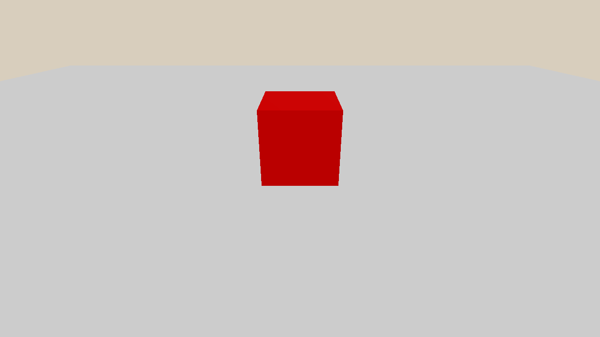

.. _hello_world:

Hello World
==================

.. highlight:: python

SAPIEN provides APIs to build physical simulation environments.

In this tutorial, you will learn the following:

* Create a simulation ``Scene``
* Setup visualization
* Run a simulation loop

The full script can be downloaded here :download:`hello_world.py <scripts/hello_world.py>`

Simulation scene
-------------------------------------

To simulate with SAPIEN, you need to first create a scene.

.. literalinclude:: scripts/hello_world.py
   :dedent: 0
   :lines: 15-16

``Scene`` is an instance of the simulation world.
Multiple scenes can be created by calling the constructor ``sapien.Scene``, and they are independent.

By default, SAPIEN uses `PhysX 5
<https://nvidia-omniverse.github.io/PhysX/physx/5.3.0/index.html>`_ to simulate
rigid bodies. ``scene.set_timestep`` sets how many seconds the physical
simulator will advance when ``scene.step`` is called.

Add rigid bodies
-------------------

So far, our scene is empty.

In SAPIEN, a scene contains a list of ``Entity``. The behavior of an ``Entity``
is determined by a list of ``Component`` attached to the ``Entity``. In SAPIEN,
we refer to an ``Entity`` with physical behavior as an Actor. For example, an
``Entity`` with an attached rigid body component is an Actor. Let's add two
actors, a ground and a box, to the scene. Actor creation will be elaborated in
:ref:`create_actors`.

.. literalinclude:: scripts/hello_world.py
   :dedent: 0
   :lines: 19-24

Viewer
-------------------------------------------

``Viewer`` creates a window (GUI) to render the simulation world. It is only
available with a connected display. The display can be physical (e.g., monitor)
or virtual (e.g., VNC). Usage of the GUI will be elaborated in :ref:`viewer`.

.. literalinclude:: scripts/hello_world.py
   :dedent: 0
   :lines: 30-38

.. note:: The GUI is not necessary when you only need simulation and rendering,
   e.g. collecting experiences for policy learning.

Simulation loop
---------------

After setting up the simulation world, the actual simulation happens in a loop.
For each iteration, the scene simulates for one step and updates the world to the renderer.
The viewer calls ``render`` to update the results on the screen.

.. literalinclude:: scripts/hello_world.py
   :dedent: 0
   :lines: 40-43

Full script
----------------

.. literalinclude:: scripts/hello_world.py
    :linenos:
    :lines: 9-
