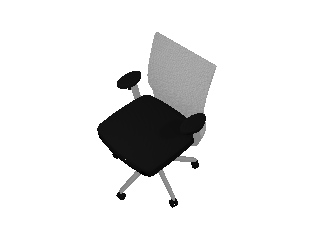
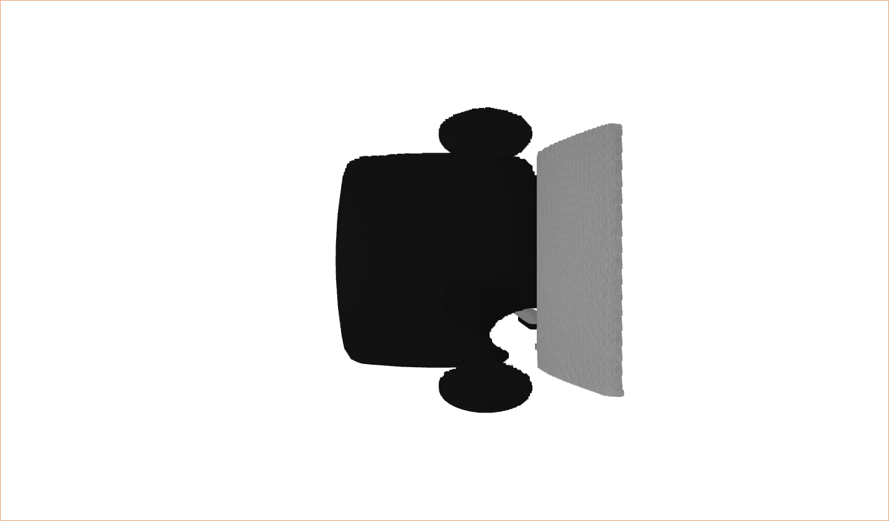
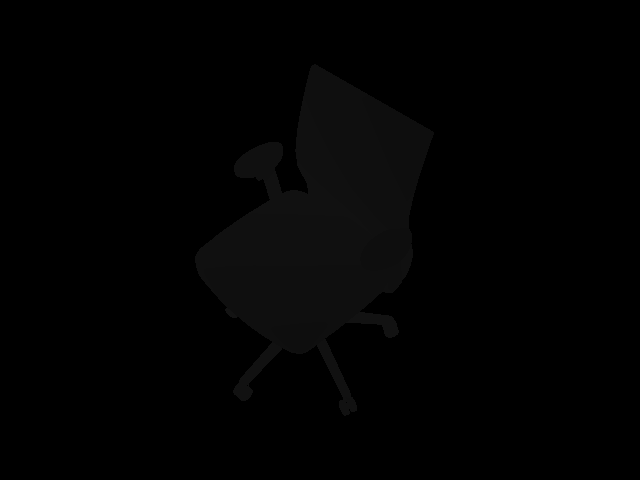
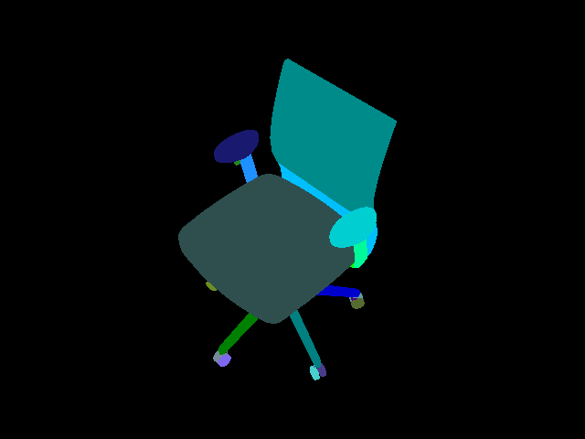
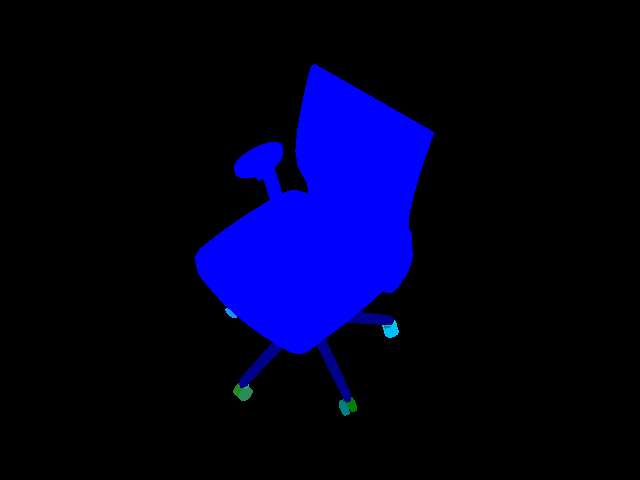
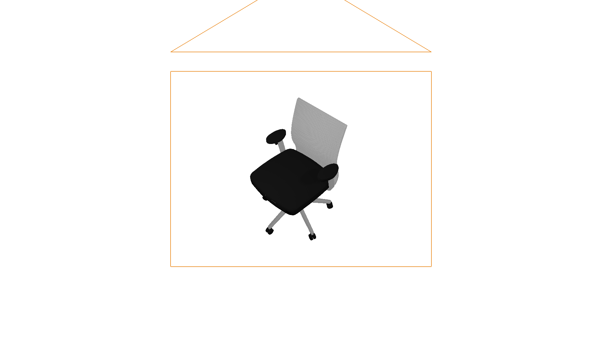

.. _camera:

Camera
==================

.. highlight:: python

In this tutorial, you will learn the following:

* Create a camera and mount it to an actor
* Off-screen rendering for RGB, depth, point cloud and segmentation

The full script can be downloaded here :download:`camera.py <scripts/camera.py>`

Create and mount a camera
------------------------------------------------------------

First of all, let's set up the engine, renderer, scene, lighting, and load a URDF file.

.. literalinclude:: scripts/camera.py
   :dedent: 0
   :lines: 18-31

SAPIEN's offscreen rendering can work without a window server like X server and
it auto detects whether on-screen display is supported. To explicitly disable
SAPIEN's on-screen rendering, call
``sapien.render.set_global_config(offscreen_only=True)`` at the beginning of the
Python program.

Next, you can create a camera

   .. literalinclude:: scripts/camera.py
       :dedent: 0
       :lines: 36-57

``scene.add_camera`` is a convenience function that creates an Entity with a
``RenderCameraComponent``.

.. note::
   ``camera.set_local_pose`` changes the camera pose relative to its parent
   entity. ``camera.set_pose`` is the same as ``camera.entity.set_pose`` and
   changes the pose of the parent entity. We encourage using
   ``camera.entity.set_pose`` to avoid errors.

You can also add a camera component to an existing entity

   .. literalinclude:: scripts/camera.py
       :dedent: 0
       :lines: 61-71

Note ``scene.add_mounted_camera`` takes a ``pose`` argument, which sets the
``local_pose`` of the camera.

When the entity has a rigid body component attached, the camera moves along with
the entity during dynamic simulation.

.. note::
    Note that the axes conventions for SAPIEN follow the conventions for robotics,
    while they are different from those for many graphics softwares (like OpenGL and Blender).
    For a SAPIEN camera, the x-axis points forward, the y-axis left, and the z-axis upward.

    However, do note that the "position" texture (camera-space point cloud)
    obtained from the camera still follows the graphics convention (x-axis
    right, y-axis upward, z-axis backward). This maintains consistency of SAPIEN
    with most other graphics software. This will be further discussed below.

Render an RGB image
------------------------------------------------------------

To render from a camera, you need to first update all object states to the renderer.
Then, you should call ``take_picture()`` to start the rendering task on the GPU.

.. literalinclude:: scripts/camera.py
    :dedent: 0
    :lines: 73-75

Now, we can acquire the RGB image rendered by the camera.
To save the image, we use `pillow <https://pillow.readthedocs.io/en/stable/>`_ here, which can be installed by ``pip install pillow``.

.. literalinclude:: scripts/camera.py
    :dedent: 0
    :lines: 80-83

Generate point cloud
------------------------------------------------------------

Point cloud is a common representation of 3D scenes.
The following code showcases how to acquire the point cloud in SAPIEN.

.. literalinclude:: scripts/camera.py
    :dedent: 0
    :lines: 88-89

We acquire a "position" image with 4 channels. The first 3 channels represent
the 3D position of each pixel in the OpenGL camera space, and the last channel
stores the z-buffer value commonly used in rendering. When is value is 1, the
position of this pixel is beyond the far plane of the camera frustum.

.. literalinclude:: scripts/camera.py
    :dedent: 0
    :lines: 91-97

Note that the position is represented in the OpenGL camera space, where the negative z-axis points forward and the y-axis is upward.
Thus, to acquire a point cloud in the SAPIEN world space (x forward and z up),
we provide ``get_model_matrix()``, which returns the transformation from the OpenGL camera space to the SAPIEN world space.

We visualize the point cloud by `trimesh <https://github.com/mikedh/trimesh>`_, which can be installed by ``pip install trimesh``.

Besides, the depth map can be obtained as well.

.. literalinclude:: scripts/camera.py
    :dedent: 0
    :lines: 106-109

Visualize segmentation
------------------------------------------------------------

SAPIEN provides the interfaces to acquire object-level segmentation.

.. literalinclude:: scripts/camera.py
    :dedent: 0
    :lines: 115-127

There are two levels of segmentation.
The first one is mesh-level, and the other one is actor-level.
The examples are illustrated below.

   Mesh-level segmentation

   Actor-level segmentation

Take a screenshot from the viewer
------------------------------------------------------------

The viewer provides a `Take Screenshot` button, which saves the current viewer
image to `sapien_screenshot_x.png`, where `x` is an integer that automatically
increases starting from 0.

The ``Window`` of the viewer also provides the same interfaces as
``CameraEntity``, ``get_picture`` and ``get_uint32_texture``, to allow
taking screenshots programmaitcally. Thus, you could take a screenshot by
calling them. Notice the definition of ``rpy`` (roll, yaw, pitch) when you set
the viewer camera.

.. literalinclude:: scripts/camera.py
    :dedent: 0
    :lines: 134-155

