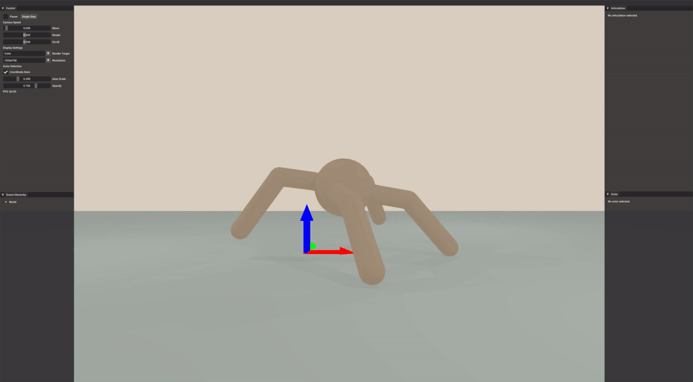

.. _gym:

Build Gym-style Interface
==========================

.. highlight:: python

.. note::
   Please first complete Get started before continuing this tutorial.

`Gymnasium (previously Gym) <https://gymnasium.farama.org/>`_ is widely used for
research on reinforcement learning. It provides a base class ``gymnasium.Env``
as the interface for many RL tasks. We are going to showcase how to write a
gym-style environment with SAPIEN.

In this tutorial, you will learn the following:

* Implement a simplified `Ant
  <https://gymnasium.farama.org/environments/mujoco/ant/>`_ environment based on
  SAPIEN
* Save and restore the simulation states

``gym`` and ``transforms3d`` are required for this example, which can be installed by ``pip install gym transforms3d``.
The full code of the Ant environment can be downloaded here :download:`ant.py <scripts/ant.py>`

SapienEnv: base class
--------------------------------------

Let's start with a base class ``SapienEnv``, which inherits ``gym.Env``. Similar
to `MujocoEnv
<https://github.com/Farama-Foundation/Gymnasium/blob/main/gymnasium/envs/mujoco/mujoco_env.py>`_,
it is a virtual class with several unimplemented member functions. The full code
of the base class can be downloaded here :download:`sapien_env.py
<scripts/sapien_env.py>`

.. literalinclude:: scripts/sapien_env.py

In the constructor, we first set up the engine, scene and renderer.
Then, we call ``self._build_world()`` to build the simulation world.
``_build_world`` is a virtual function to implement.
Besides, ``_setup_viewer`` is another virtual function used for on-screen visualization.

.. note::
   SAPIEN does not support creating a simulation world from a XML directly, like Mujoco MJCF.
   But users can write their own parsers with their preferred formats.

AntEnv: environment
-----------------------

Based on ``SapienEnv``, we can create a gym-style environment ``AntEnv``.
First, we need to update the constructor and implement ``_build_world`` to build the simulation world.
It creates the ground and an ant articulation.
The implementation of ``create_ant`` is not shown here.
The initial state of the actuator (ant) is stored, which will be restored every time the environment is reset.

.. literalinclude:: scripts/ant.py
   :dedent: 0
   :lines: 20-45
   :emphasize-lines: 7

Furthermore, we need to implement two important virtual functions of ``gym.Env``, ``step`` and ``reset``.

.. literalinclude:: scripts/ant.py
   :dedent: 0
   :lines: 179-215
   :emphasize-lines: 28

``step`` runs one timestep of the environment's dynamics, and ``reset`` resets the state of the environment.
For our implementation, we restore the state of the whole scene and add some noise to initial joint states when the environment is reset.

Random Agent
---------------------

As a gym environment, we can run the environment with a random agent.

.. literalinclude:: scripts/ant.py
   :dedent: 0
   :lines: 255-265
